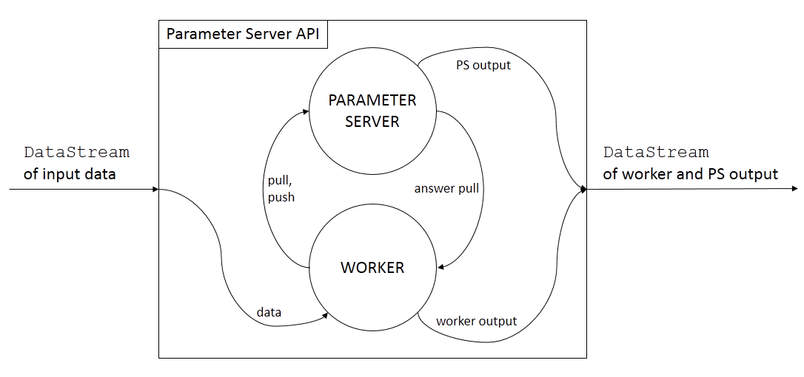

# Flink Parameter Server

A Parameter Server implementation based on the
[Streaming API](https://ci.apache.org/projects/flink/flink-docs-stable/dev/datastream_api.html) of [Apache Flink](http://flink.apache.org/).

Parameter Server is an abstraction for model-parallel machine learning (see the work of [Li et al.](https://doi.org/10.1145/2640087.2644155)).
Our implementation could be used with the Streaming API:
it can take a `DataStream` of data-points as input, and produce a `DataStream` of model updates. This way, we can implement both online and offline ML algorithms. Currently only asynchronous training is supported.

# Build
Use [SBT](http://www.scala-sbt.org/). It can be published to the local SBT cache

```bash
sbt publish-local
```

and then added to a project as a dependency

```sbt
libraryDependencies += "hu.sztaki.ilab" %% "flink-ps" % "0.1.0"
```

# API

We can use the Parameter Server in the following way:



Basically, we can access the Parameter Server by defining a [```WorkerLogic```](https://github.com/gaborhermann/flink-ps/blob/master/src/main/scala/hu/sztaki/ilab/ps/WorkerLogic.scala), which can *pull* or *push* parameters. We provide input data to the worker via a Flink ```DataStream```.

We need to implement the ```WorkerLogic``` trait
```scala
trait WorkerLogic[T, Id, P, WOut] extends Serializable {
  def onRecv(data: T, ps: ParameterServerClient[Id, P, WOut]): Unit
  def onPullRecv(paramId: Id, paramValue: P, ps: ParameterServerClient[Id, P, WOut]): Unit
}
```
where we can handle incoming data (`onRecv`), *pull* parameters from the Parameter Server, handle the answers to the pulls (`onPullRecv`), and *push* parameters to the Parameter Server or *output* results. We can use the ```ParameterServerClient```:
```scala
trait ParameterServerClient[Id, P, WOut] extends Serializable {
  def pull(id: Id): Unit
  def push(id: Id, deltaUpdate: P): Unit
  def output(out: WOut): Unit
}
```

When we defined our worker logic we can wire it into a Flink job with the `transform` method of [```FlinkParameterServer```](src/main/scala/hu/sztaki/ilab/ps/FlinkParameterServer.scala).

```scala
def transform[T, Id, P, WOut](
  trainingData: DataStream[T],
  workerLogic: WorkerLogic[T, Id, P, WOut],
  paramInit: => Id => P,
  paramUpdate: => (P, P) => P,
  workerParallelism: Int,
  psParallelism: Int,
  iterationWaitTime: Long): DataStream[Either[WOut, (Id, P)]]
```

Besides the `trainingData` stream and the `workerLogic`, we need to define how the Parameter Server should initialize a parameter based on the parameter id (`paramInit`), and how to update a parameter based on a received push (`paramUpdate`). We must also define how many parallel instances of workers and parameter servers we should use (`workerParallelism` and `psParallelism`), and the `iterationWaitTime` (see [Limitations](README.md#limitations)).

There are also other options to define a DataStream transformation with a Parameter Server which let us specialize the process in more detail. See the different methods of [```FlinkParameterServer```](src/main/scala/hu/sztaki/ilab/ps/FlinkParameterServer.scala).

# Limitations

We implement the two-way communication of workers and the parameter server with Flink Streaming [iterations](https://ci.apache.org/projects/flink/flink-docs-release-1.3/dev/datastream_api.html#iterations), which is not yet production-ready. The main issues are
- **Sometimes deadlocks due to cyclic backpressure.** A workaround could be to limiting the amount of unanswered pulls per worker (e.g. by using [WorkerLogic.addPullLimiter](src/main/scala/hu/sztaki/ilab/ps/WorkerLogic.scala#L169)), or manually limiting the input rate of data on the input stream. In any case, deadlock would still be possible.
- **Termination is not defined for finite input.** As a workaround, we can set the `iterationwaitTime` for the milliseconds to wait before shutting down if there's no messages sent along the iteration (see the Flink (Java Docs)https://ci.apache.org/projects/flink/flink-docs-master/api/java/)).
- **No fault tolerance.**

All these issues are being addressed in [FLIP-15](https://cwiki.apache.org/confluence/pages/viewpage.action?pageId=66853132) and [FLIP-16](https://cwiki.apache.org/confluence/display/FLINK/FLIP-16%3A+Loop+Fault+Tolerance) and soon to be fixed. Until then, we need to use workarounds.
